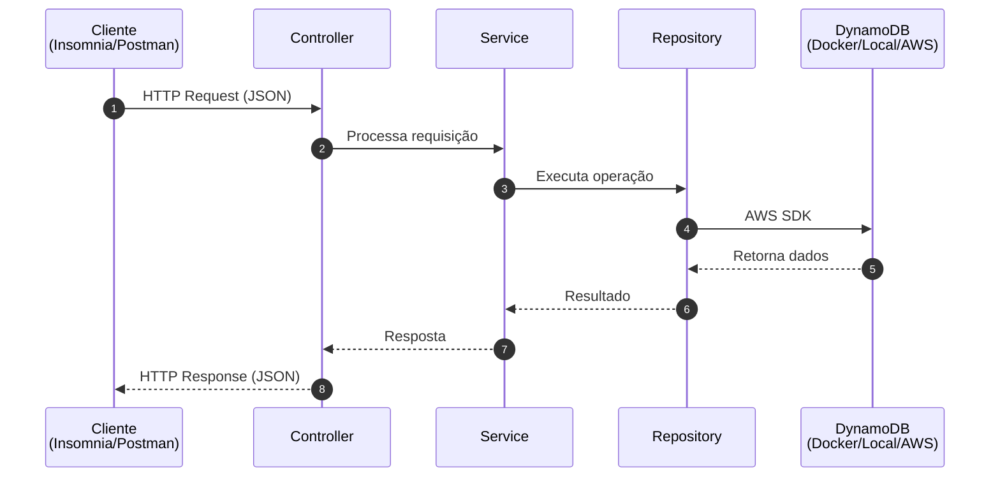

# 🛒 API REST Customer | AWS DynamoDB & Java Spring Data

> API REST para gerenciamento de clientes ("customers"), construída com **Java + Spring Data** e persistência em **AWS
DynamoDB**. Projeto de estudo focado em boas práticas de back-end: testes automatizados, mutation testing,
> containerização e integração com serviços AWS.

<div align="center">

[](https://codecov.io/gh/flaviohnm/dynamodb)
[](https://dashboard.stryker-mutator.io/reports/github.com/flaviohnm/dynamodb/main)

</div>

---

## 📑 Sumário

- [🛒 API REST Costumer | AWS DynamoDB \& Java Spring Data](#-api-rest-costumer--aws-dynamodb--java-spring-data)
  - [📑 Sumário](#-sumário)
  - [📖 Sobre o Projeto](#-sobre-o-projeto)
  - [🏗 Arquitetura](#-arquitetura)
  - [🚀💻 Tecnologias \& Ferramentas](#-tecnologias--ferramentas)
  - [💻 Modelagem no DynamoDB](#-modelagem-no-dynamodb)
  - [▶️ Como Executar](#️-como-executar)
    - [Pré-requisitos](#pré-requisitos)
    - [Passo a passo](#passo-a-passo)
  - [📡 Endpoints da API](#-endpoints-da-api)
  - [🧪 Testes](#-testes)
  - [🗺 Roadmap](#-roadmap)
  - [✍️ Comentários sobre o projeto](#️-comentários-sobre-o-projeto)
  - [👨‍🚀 Autor](#-autor)

---

## 📖 Sobre o Projeto

Este projeto implementa uma **API REST de clientes** com **Spring Boot** e **Amazon DynamoDB**. O objetivo é servir como estudo prático de:

- modelagem de dados NoSQL com DynamoDB;
- construção de APIs REST seguindo boas práticas;
- qualidade de código com testes unitários e mutation testing;
- uso de containerização para simular o ambiente local.

A aplicação expõe endpoints para criar, listar, buscar, atualizar e desativar clientes em uma tabela `customers`.

## 🏗 Arquitetura



## 🚀💻 Tecnologias & Ferramentas

<div align="left">
  <h3>Linguagens & Frameworks</h3>
  <a href="https://github.com/flaviohnm?tab=repositories&language=java"></a>
  <a href="https://github.com/flaviohnm?tab=repositories&language=java"></a>
  <a href="https://github.com/flaviohnm?tab=repositories&language=java"></a>

<h3>Ferramentas</h3>


</div>

## 💻 Modelagem no DynamoDB

Tabela `customers`, com `id` como chave primária (partition key):

```json
{
  "TableName": "customers",
  "AttributeDefinitions": [
    {
      "AttributeName": "id",
      "AttributeType": "S"
    },
    {
      "AttributeName": "company_name",
      "AttributeType": "S"
    }
  ],
  "KeySchema": [
    {
      "AttributeName": "id",
      "KeyType": "HASH"
    }
  ],
  "ProvisionedThroughput": {
    "ReadCapacityUnits": 5,
    "WriteCapacityUnits": 5
  },
  "GlobalSecondaryIndexes": [
    {
      "IndexName": "xCompanyName",
      "KeySchema": [
        {
          "AttributeName": "company_name",
          "KeyType": "HASH"
        }
      ],
      "Projection": {
        "ProjectionType": "ALL"
      },
      "ProvisionedThroughput": {
        "ReadCapacityUnits": 1,
        "WriteCapacityUnits": 1
      }
    }
  ]
}
```

## ▶️ Como Executar

### Pré-requisitos

- Java 21+
- Maven ou wrapper do projeto (`./mvnw`)
- Docker e Docker Compose

### Passo a passo

```bash
# 1. Clone o repositório
git clone https://github.com/flaviohnm/dynamodb.git
cd dynamodb

# 2. Suba o ambiente local do DynamoDB
docker compose up -d

# 3. Compile e rode os testes
./mvnw test

# 4. Inicie a aplicação
./mvnw spring-boot:run
```

A API ficará disponível em `http://localhost:9595`.

O DynamoDB local é acessado em `http://localhost:4566` e o painel administrativo fica em `http://localhost:8001`.

> O ambiente local usa um serviço compatível com LocalStack/Floci, com credenciais `test/test` e região `sa-east-1`.

## 📡 Endpoints da API

| Método | Rota | Descrição | Status esperado |
|--------|------|-----------|-----------------|
| `POST` | `/v1/customers` | Cria um novo cliente | `201 Created` |
| `GET` | `/v1/customers` | Lista todos os clientes | `200 OK` |
| `GET` | `/v1/customers?companyName=Empresa%20X` | Busca clientes por nome da empresa | `200 OK` |
| `GET` | `/v1/customers/query?companyName=Empresa%20X` | Busca específica por nome da empresa | `200 OK` |
| `PATCH` | `/v1/customers` | Atualiza dados de um cliente | `200 OK` |
| `PATCH` | `/v1/customers/{companyDocumentNumber}` | Desativa um cliente pelo documento | `200 OK` |

### Exemplos de uso

```bash
# Criar cliente
curl -X POST http://localhost:9595/v1/customers   -H "Content-Type: application/json"   -d '{
    "companyName": "Empresa Teste",
    "companyDocumentNumber": "12345678000199",
    "phoneNumber": "81999999999"
  }'

# Listar todos
curl http://localhost:9595/v1/customers

# Filtrar por nome
curl "http://localhost:9595/v1/customers?companyName=Empresa%20Teste"

# Buscar por nome da empresa
curl "http://localhost:9595/v1/customers/query?companyName=Empresa%20Teste"
```

> Observação: o `GET /v1/customers` tem comportamento condicional:
> - sem `companyName` → lista todos;
> - com `companyName` → filtra os resultados.

## 🧪 Testes

O projeto utiliza **JUnit 5** para testes unitários/integração e **Pitest** para mutation testing. Isso ajuda a verificar se os testes realmente validam o comportamento da aplicação e não apenas as linhas executadas.

```bash
# Rodar testes unitários
./mvnw test

# Rodar mutation testing
./mvnw test-compile org.pitest:pitest-maven:mutationCoverage
```

Os resultados de cobertura e mutação podem ser consultados nos relatórios do JaCoCo e no dashboard do Pitest, conforme a configuração do pipeline do GitHub Actions.

## 🗺 Roadmap

- [ ] Publicar a aplicação com GitHub Actions (CI/CD)
- [ ] Adicionar documentação da API com Swagger/OpenAPI
- [ ] Deploy em ambiente AWS real (Lambda + API Gateway ou ECS)

## ✍️ Comentários sobre o projeto

Este projeto foi baseado no documento publicado por Kaike Ventura.
[](https://www.linkedin.com/in/kaike-ventura-185695aa/)

---

## 👨‍🚀 Autor

Feito por **Flavio Monteiro** 👋

<a target="_blank" href="mailto:flaviohnm@gmail.com"></a>
<a target="_blank" href="https://www.linkedin.com/in/flaviohnm/"></a>
<a href="https://buymeacoffee.com/flaviohnm" title="buy me a coffee" target="_blank"></a>
